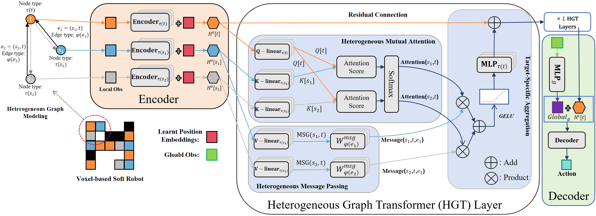

# HeteroMorpheus
This is the code for the paper [HeteroMorpheus: Universal Control Based on Morphological Heterogeneity Modeling] at IJCNN 2024.

In the field of robotic control, designing individual controllers for each robot leads to high computational costs. Universal control policies, applicable across diverse robot morphologies, promise to mitigate this challenge. Predominantly, models based on Graph Neural Networks (GNN) and Transformers are employed, owing to their effectiveness in capturing relational dynamics across a robot's limbs. However, these models typically employ homogeneous graph structures that overlook the functional diversity of different limbs. To bridge this gap, we introduce HeteroMorpheus, a novel method based on heterogeneous graph Transformer. This method uniquely addresses limb heterogeneity, fostering better representation of robot dynamics of various morphologies. Through extensive experiments we demonstrate the superiority of HeteroMorpheus against state-of-the-art methods in the capability of policy generalization, including zero-shot generalization and sample-efficient transfer to unfamiliar robot morphologies.

Our work builds upon [MetaMorph](https://arxiv.org/abs/2203.11931), a SOTA transformer-based method for universal morphology control, i.e., learning a universal policy that can generalize across different morphologies. We further propose to use heterogeneous graph Transformer(HGT) and the morphology-based message passing scheme to better model the complex dependence between robot morphology and control policy. See our paper for more details. 

We choose [Evolution Gym](https://evolutiongym.github.io/), a specialized simulation platform for voxel-based soft robots (VSRs), as our evaluation environment. Unlike rigid-body simulations, VSRs are normally arranged in grid structure, offering expansive design possibilities compared to rigid robots. Our experiments encompass five tasks in Evogym, comprising two locomotion tasks (Walker-v0, UpStepper-v0) and three manipulation tasks (Pusher-v0, Carrier-v0, Catcher-v0).

The overall architecture of HeteroMorpheus is shown in the figure below：


# Installation

Clone the repo and submodules:

```shell
git clone --recurse-submodules https://github.com/hyf1530588058/HeteroMorpheus.git
```

### Requirements
* Python 3.7
* Linux
  
```shell
sudo apt-get install xorg-dev libglu1-mesa-dev
```

Install Python dependencies with pip:

```shell
pip install -r requirements.txt
```

## Running the code
For multi-robot training, run the following commands to train with different methods. 

AMORPHEUS:

```shell
python run_amorpheus.py --env-name "Walker-v0" --algo ppo --use-gae --lr 0.0001 --clip-param 0.1 --value-loss-coef 0.5 --num-processes 16 --num-steps 128 --num-mini-batch 12 --log-interva  100 --use-linear-lr-decay --entropy-coef 0.01 --eval-interval 50
```

MetaMorph: 

```shell
python run_metamorph.py --env-name "Walker-v0" --algo ppo --use-gae --lr 0.0001 --clip-param 0.1 --value-loss-coef 0.5 --num-processes 16 --num-steps 128 --num-mini-batch 12 --log-interva  100 --use-linear-lr-decay --entropy-coef 0.01 --eval-interval 50
```

HeteroMorpheus-D: 

```shell
python run_heteromorpheus_D.py --env-name "Walker-v0" --algo ppo --use-gae --lr 0.0001 --clip-param 0.1 --value-loss-coef 0.5 --num-processes 16 --num-steps 128 --num-mini-batch 12 --log-interva  100 --use-linear-lr-decay --entropy-coef 0.01 --eval-interval 50
```

HeteroMorpheus-N: 

```shell
python run_heteromorpheus_N.py --env-name "Walker-v0" --algo ppo --use-gae --lr 0.0001 --clip-param 0.1 --value-loss-coef 0.5 --num-processes 16 --num-steps 128 --num-mini-batch 12 --log-interva  100 --use-linear-lr-decay --entropy-coef 0.01 --eval-interval 50
```

## Hyperparameter

The meaning and values of the hyperparameters required for experimental running can be found in examples/ppo/arguments.py
